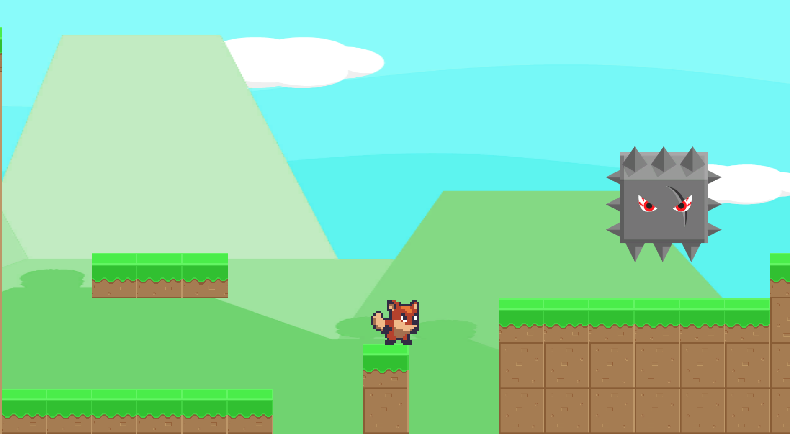
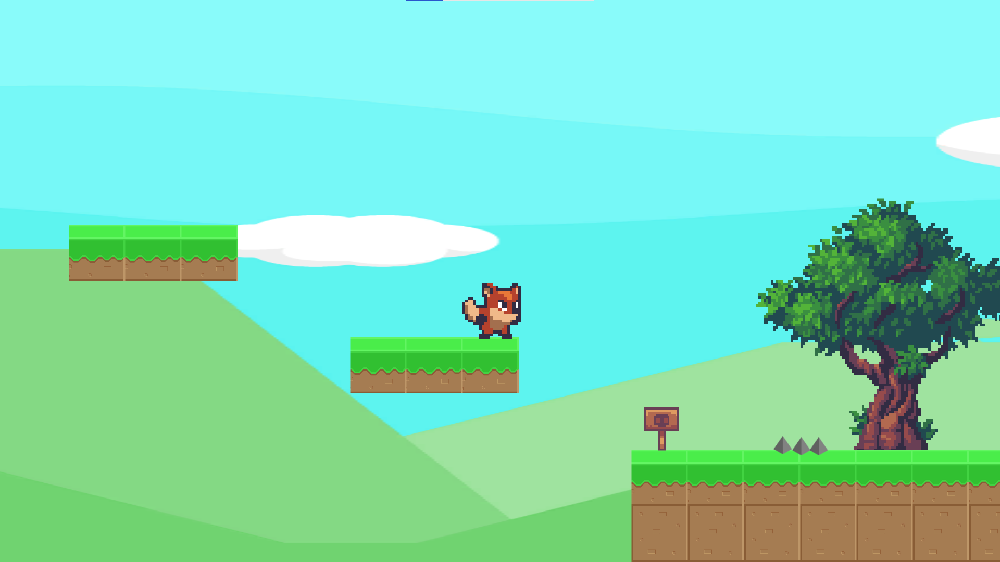

# Összefoglaló

[Demo videó](https://youtu.be/CJsmYPR6vTQ)

[Demo videó kiegészítésekkel](https://youtu.be/q7TF8-_Vri4)

A feladatom egy plaftformer játék implemetálása, Unity 2D keretrendszerben. A feladathoz használtam ingyenesen letölthető asseteket, amiket a [Unity Asset Store](https://assetstore.unity.com/?gclid=Cj0KCQjws-OEBhCkARIsAPhOkIYNuw8LUkBji7Y2pqaVg2Htpc1WLckOp5LCVUIztR5or9Sw3cCEFfsaApEZEALw_wcB)ból töltöttem le.

A játék lényege, hogy a karaktert juttassuk el a pálya végéig, úgy hogy közben nem szabad leesni a pályáról és el kell kerülni az ellenfeleket. Ha a játékos "meghal", akkor visszakerül a kiindulási helyére, ahonnan újra kell kezdeni a pályát.

Az első pálya teljesítése után lehetőség van a második pálya játszására is. Ez a pálya már kicsit nehezebb.

Adtam a játékhoz háttérzenét, meg hangot az ugráshoz és a meghaláshoz.

Felhasznált assetek:
 
- [Free Platform Game Assets](https://assetstore.unity.com/packages/2d/environments/free-platform-game-assets-85838)
- [Sunny Land](https://assetstore.unity.com/packages/2d/characters/sunny-land-103349)
- [Audio](https://mixkit.co/free-sound-effects/game)
